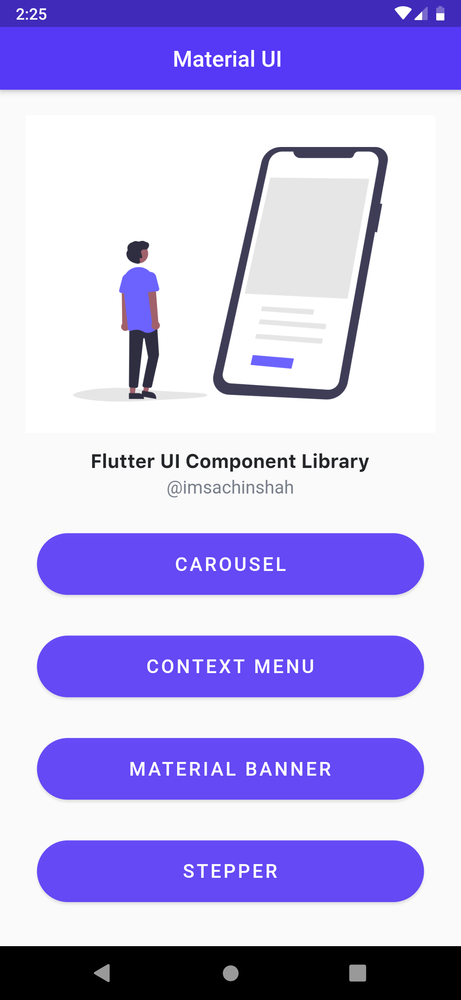

# Flutter UI Components

A new Flutter project.

## Getting Started

This is the Flutter application where I have used of routing to display the UI Components which we use in our apps.

1. Carousel
2. Context Menu
3. Material Banner
4. Stepper 

### Carousel 

It is the UI component which is used to show collection of information in the form of card.
It helps us to rap data like images, texts and other things in container.

### Context Menu

It is the menu, we use in the appBar where the menu have sub-menu to be used.

### Material Banner

It is form of banner which we can used a to show some info to a customer as a discount or some important announcement.

### Stepper

Stepper are used for selecting the quantity of the product. It commonly used in e-commerce sites or food delivery apps.

<a>

<a>

<a >

<a>

### You can connect with me:

- [LinkedIn](https://linkedin.com/in/imsachinshah)
- [Twitter](https://twitter.com/imsachinshah)
- [Instagram](https://instagram.com/imsachinshah0)

